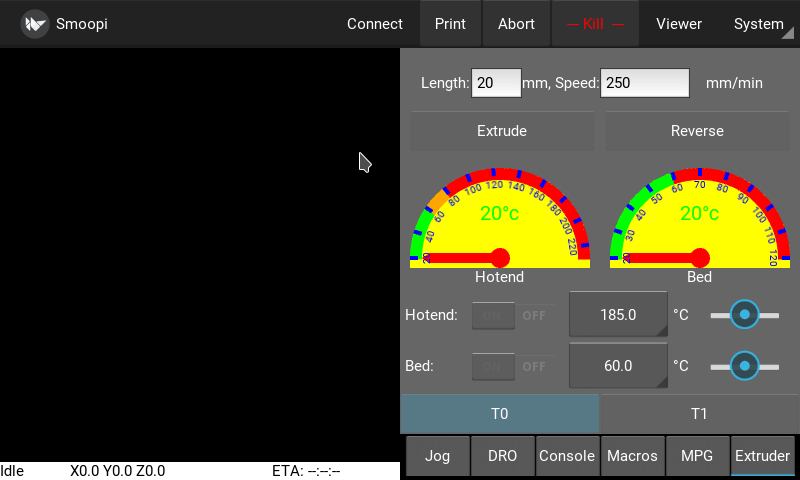
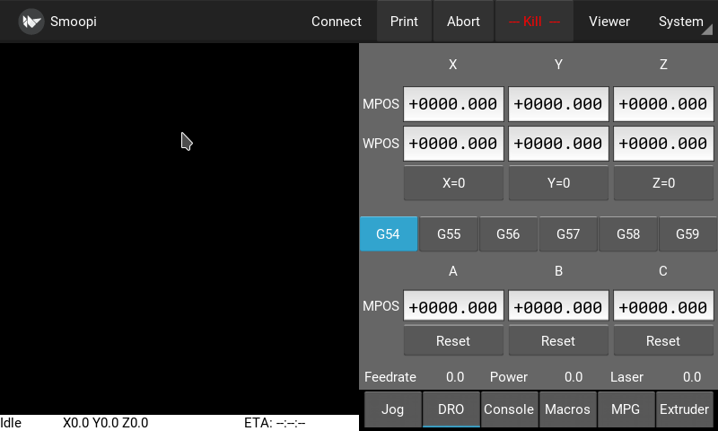
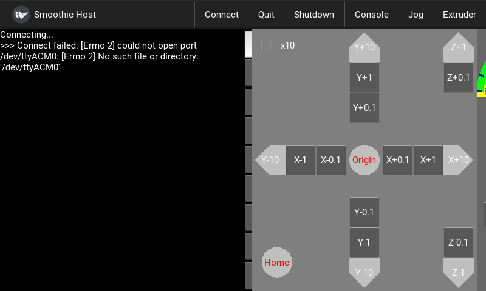
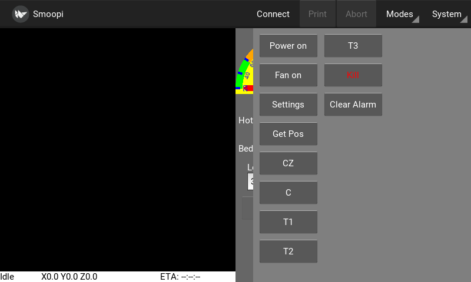
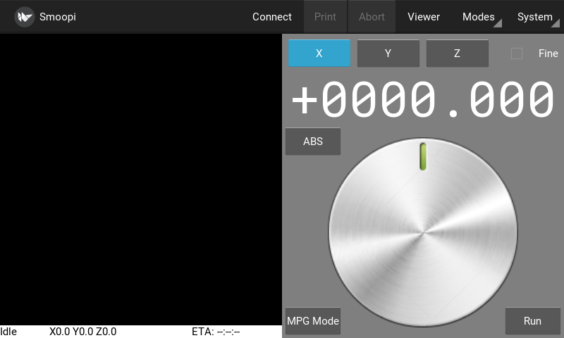
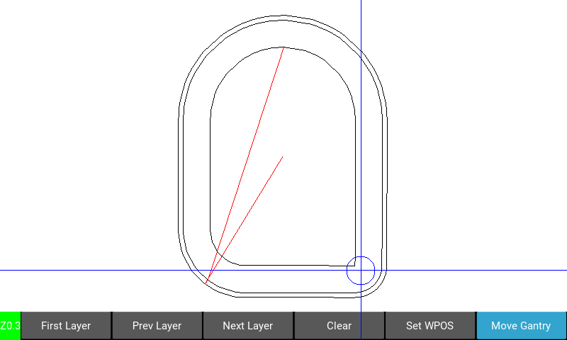

# kivy-smoothie-host
A Smoothie host, written in Kivy for running on rpi with touch screen or on a desktop.

This is a work in progress, but is stable and ready for everyday use.

This uses python >= 3.4.3

Use an RPI-3 Model B or B+, or the RPI-3 Model A+ with RPI touch screen.
Also runs on pretty much any Linux desktop (and maybe Mac or Windows if Kivy runs on them).

## Goal
The goal is to have a small touch screen host that can run a smoothie and is better than an LCD Panel, and almost as good as a host PC running pronterface.
It is not meant to be a replacement for say Octoprint whose goals are different.
A secondary goal is to have a decent smoothie aware desktop host to replace Pronterface, that has good support for CNC tasks as well as 3D printing.

(*UPDATE* there is now a desktop layout setting that makes it more usable on a regular desktop, it has been tested on various linux machines but should run anywhere that python3 and kivy will run).

An RPI with 7" touch screen is about the same price as the better LCD panels, and makes a great standalone controller for a 3D printer.

## Usage

To select the port to connect to click the System menu and select Port, then select the serial port from the list, or for a network connection select Network...
then enter the host or ip optionally followed by the port :23 (23 is the default if not specified), eg smoothieip or 192.168.0.2:23
Once you have selected a port to connect to it is saved in the ini file, and you can then click the connect menu item to connect.

The left screen is the console and displays messages from smoothie, the right screen is a selection of panels (Modes) which can be switched to using the tabs to select the panel you want, you can scroll the left screen up and down by swiping up or down.

There is a status bar at the bottom left showing status, DRO and print ETA when printing.

You can select 3d printer mode or CNC mode from the Settings menu, this can affect what Panels are available amongst other minor changes.

- The Console panel has a keyboard for entering gcodes and if you touch the edit field a keyboard will pop up for typing commands (non gcodes). If you precede the command with ! it will be sent to the linux shell instead of smoothie. Sending ? will pop up a GCode reference screen.
- The Extruder Panel is used to control temperatures and extuder. You can switch between gauge view and graph view by swiping left or right (or double click)
- The Jog Panel has the usual jog controls.
- The Macro Panel is a user configurable buttons panel to control whatever you want. (Edit the `macros.ini` file)
  There is a `sample-macros.ini` just copy that to `macros.ini` and edit as appropriate to define your own macro buttons.
- The DRO Panel shows current MCS and WCS, and allows easy selection of the WCS to use, and allows setting of WCS
- The MPG Panel is a simulation of an MPG pendant, it allows control of movement via a simulated rotary knob. (There is an optional module to take controls from a real MPG USB pendant).
- The config editor displays the current smoothie config in a scrollable window, values can be updated click the return key and then will update the config on sd accordingly. (reset is of course required to take effect).

There is a gcode visualizer window that shows the layers, or for CNC allows setting WPOS and moving the gantry to specific parts of the Gcode...
Click the Viewer menu item, select the file to view, then the layers can be moved up or down.
To set the WPOS to a point in the view click the select button, then touch the screen to move the crosshairs, when you have the point you want selected then click the set WPOS button, that point will be set as WPOS. To move the gantry to a point on the view click the select button, then touch and drag until you get the point and then click the move to button, the gantry will move to that point.

The Kivy file browser is pretty crude and buggy. To allow it to be usable on a touch panel I had to set it so directory changes require double taps on the directory. I also do not enable the Load button unless a valid file is selected by tapping the file. This allows swiping to scroll the file lists to work reliably. 
If running in desktop mode you can select a different native file chooser from the settings page. (You will need to install zenity or kdialog or wx for python3)

The Update System menu entry requires git to be installed and the running directory be a valid git repo pointing to github.

When running on a desktop you can jog using the keyboard up/down/left/right/pgup/pgdown keys, the default jog is 0.1mm, if ctrl key is pressed it is 0.01mm, if shift is pressed it is 1mm. pgup/pgdown move the Z axis. up/down move the Y axis and left/right move the X axis.

### Macros
Macro buttons can be defined in the `macros.ini` file that can issue simple commands, can be toggle buttons, can be toggle buttons that monitor switches (eg fan, psu), that can issue shell commands to the host O/S, and that can run scripts on the host O/S that communicate with smoothie. (See sample-macros.ini).
Simple macro buttons can be created by clicking the green `New Macro` button.


## Install on RPI

### Rasbian/Debian Stretch

Install the latest raspbian stretch lite... 
https://downloads.raspberrypi.org/raspbian_lite_latest

Follow these instructions if using an rpi 3 B+ and rasbian stretch...
https://kivy.org/doc/stable/installation/installation-rpi.html

But change all references to python.. to python3.. As we need kivy for python3.

For instance...

    sudo apt-get update
    sudo apt-get install libsdl2-dev libsdl2-image-dev \
       libsdl2-mixer-dev libsdl2-ttf-dev \
       pkg-config libgl1-mesa-dev libgles2-mesa-dev \
       python3-setuptools libgstreamer1.0-dev git-core \
       gstreamer1.0-plugins-{bad,base,good,ugly} \
       gstreamer1.0-{omx,alsa} python3-dev libmtdev-dev \
       xclip xsel
    sudo apt-get install python3-pip
    sudo pip3 install -U Cython==0.28.2
    sudo pip3 install git+https://github.com/kivy/kivy.git@master

On an rpi3b+ it seems the double tap time needs to be increased to be usable..

    # in file ~/.kivy/config.ini
    [postproc]
    double_tap_distance = 20
    double_tap_time = 400 # <-- increase this from the 200 default
    triple_tap_distance = 20
    triple_tap_time = 600 # <- and this to be > than double_tap_time


### OR kivypie
or use kivypie from here  http://kivypie.mitako.eu/ and the official 7" touch screen, pretty much runs out-of-the-box. 
(NOTE WIFI does not work for the rpi3 A+/B+, so use Rasbian Stretch above).

If you do not have kivypie, but have jessie installed and just want kivy for rpi then...

    $ echo "deb http://archive.mitako.eu/ jessie main" > /etc/apt/sources.list.d/mitako.list
    $ curl -L http://archive.mitako.eu/archive-mitako.gpg.key | apt-key add -
    $ apt-get update
    $ sudo apt-get install python3-kivypie

### Common setup
It is recommended to do this:- 

    > sudo apt-get update
    > sudo apt-get upgrade

Install some smoopi dependencies...

    > pip3 install pyserial pyserial-asyncio aiofiles

Run with...

> python3 main.py

NOTE make sure the ```~/.kivy/config.ini``` has the following set so the virtual keyboard works in a usable fashion on an RRI touch screen...

    [kivy]
    keyboard_mode = systemanddock
    desktop = 0

If your ```~/.kivy/config.ini``` is empty or not setup for the touch display then here is an example that works for the RPI official 7" touch screen:-
https://gist.github.com/4f9c23c7e66f391b8c2d32c01e8a8d14

To allow the program to shutdown the RPI when the shutdown menu entry is selected you need to do the following, unless smoopi is running as root/superuser.


    Use policykit (make sure policykit-1 is installed).

    Create as root /etc/polkit-1/localauthority/50-local.d/all_all_users_to_shutdown_reboot.pkla with the 
    following content:

    [Allow all users to shutdown and reboot]
    Identity=unix-user:*
    Action=org.freedesktop.login1.power-off;org.freedesktop.login1.power-off-multiple-sessions;org.freedesktop.login1.reboot;org.freedesktop.login1.reboot-multiple-sessions
    ResultAny=yes

### Autostart Smoopi (Optional)

To autostart smoopi on boot but run as the sysop user follow these directions...
(if using a rasbian installation replace user sysop with pi)

1. Install runit (sudo apt-get install runit). On Raspbian Stretch also do ```sudo apt-get install runit-systemd```
2. in the sysop home directory run ```tar xvf INSTALLDIR/runit_setup.tar``` (where INSTALLDIR is where you checked out the smoopi source)
3. sudo ln -s /home/sysop/sv/smoopi /etc/service (or sudo ln -s /home/pi/sv/smoopi if not using kivypie)


To allow Smoopi to connect to the smoothie when auto start by runit you need to do this...
    
    sudo jove /etc/udev/rules.d/90-smoothie.rules
    and add this...

    SUBSYSTEM=="usb", ATTRS{idVendor}=="1d50", ATTRS{idProduct}=="6015", MODE="0666"
    SUBSYSTEM=="tty", ATTRS{idVendor}=="1d50", ATTRS{idProduct}=="6015", MODE="0666", SYMLINK+="smoothie%n"


smoopi is now managed by runit. (This has the side effect of restarting smoopi if it crashes).

The smoopi app will start, and will also start on boot. (To stop it you type ```sudo sv stop /etc/service/smoopi```)

### Shutdown and Startup button for RPI (Optional)
Optionally to add a button to boot and to shutdown the rpi install a NORMALLY OPEN push button on pins 5 and 6 on the header, 
then you need to add the shutdown script to autostart... ```sudo ln -s /home/sysop/sv/shutdown /etc/service```. NOTE you may need a capacitor across the button to stop noise shutting down the system.

### Backlight on RPI
To allow Smoopi to turn on/off the backlight you need to do this...

    sudo nano /etc/udev/rules.d/backlight-permissions.rules
    and add this...
    SUBSYSTEM=="backlight",RUN+="/bin/chmod 666 /sys/class/backlight/%k/brightness /sys/class/backlight/%k/bl_power"

NOTE the default is for no blanking, there is a setting under the settings menu that allows you to set the timeout for blanking the screen, it is initially set to 0 which is no blanking. If it blanks then touching the screen will unblank it.

### Builtin webserver and optional camera
In Settings you can turn on the webserver which will simply allow you to get current progress from any web browser, nothing fancy.
Also in Settings you can enable the video option which uses mjpg-streamer 
(which needs to be built and installed, See https://github.com/jacksonliam/mjpg-streamer.git for instructions on that). If enabled and running then the video will show up in the progress web page.
There is also a camera option in the system menu which allows a preview of the camera view, the url for this is also in the settings, and should be the url which gets a snapshot single jpeg frame from the camera.

## On linux Desktop (and maybe windows/macos)

Install kivy for python3 from your distro:-

https://kivy.org/docs/installation/installation.html

1. sudo add-apt-repository ppa:kivy-team/kivy
2. sudo apt-get update
3. sudo apt-get install python3-kivy

or get the latest version of kivy if the distro version is too old (currently using  1.10.x)

    sudo pip3 install kivy


Install some dependencies we need...

    sudo pip3 install pyserial pyserial-asyncio aiofiles

Run as

    > cd kivy-smoothie-host
    > python3 main.py

In settings set the desktop layout to 1 or 2 and restart. 1 is for smaller screens and 2 is for bigger screens.

## Smoothie version required

This requires the latest FirmwareBin/firmware-latest.bin from Smoothie github, (or FirmwareBin/firmware-cnc-latest.bin).

__NOTE__ to use the T0 and T1 buttons in the Extruder panel the temperature controls need to have the following designators 'T' and 'T1'. The temperature for the currently selected tool will show, and the set temp will apply to that tool.

## Pendants
There is support for a hacked raw MPG pendant using a Teensy as a rawhid device.

Project here...
* https://github.com/wolfmanjm/mpg-usb
* install as described there

Then you need to do the following on the rpi...

* sudo apt-get install libffi-dev
* sudo apt-get install libhidapi-libusb0
* git clone https://github.com/ahtn/python-easyhid
* cd python-easyhid
* sudo python3 setup.py install
* add to the smoothiehost.ini file...

     [modules]
     mpg_rawhid = 0x16C0:0x0486

* create a file /etc/udev/rules.d/49-teensy.rules and add the following...

    ATTRS{idVendor}=="16c0", ATTRS{idProduct}=="04[789B]?", ENV{ID_MM_DEVICE_IGNORE}="1"
    ATTRS{idVendor}=="16c0", ATTRS{idProduct}=="04[789A]?", ENV{MTP_NO_PROBE}="1"
    SUBSYSTEMS=="usb", ATTRS{idVendor}=="16c0", ATTRS{idProduct}=="04[789ABCD]?", MODE:="0666"
    KERNEL=="ttyACM*", ATTRS{idVendor}=="16c0", ATTRS{idProduct}=="04[789B]?", MODE:="0666"


Then you will have the MPG/Pendant controller available for jogging etc.

(NOTE you need the latest version of smoothieware dated greater than 1 October 2018 to support the $J command)


# Screen shots








